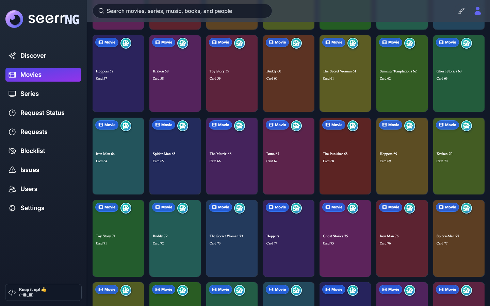
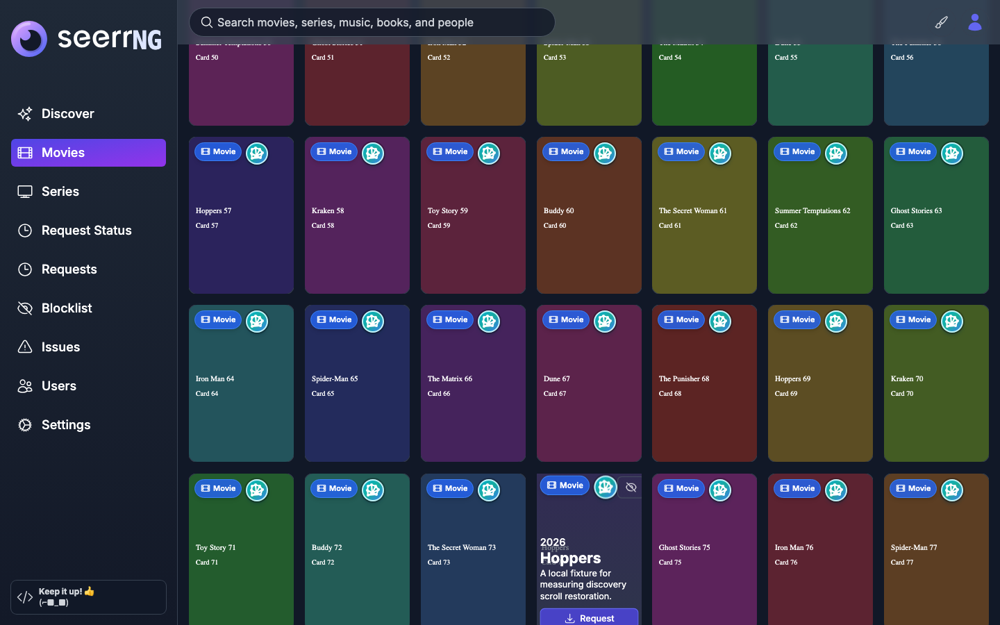
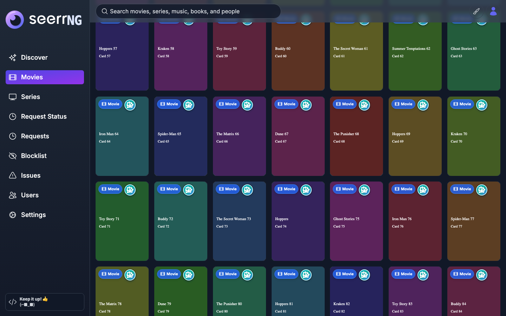
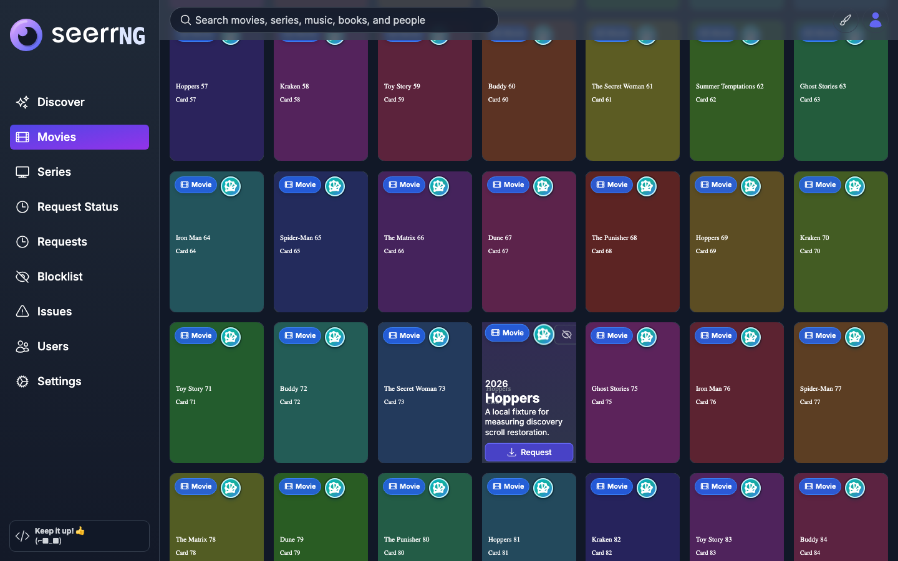

# Discovery Back navigation browser evidence

Playwright recordings and unmodified viewport screenshots from locally running SeerrNG production builds. The catalog and poster artwork are deterministic test fixtures, including a movie called Hoppers, so no private library or account data is published. These runs render the application and load its real detail components; the script does not inject CSS.

- Original source: [`47330370`](https://github.com/snapetech/seerrng/commit/47330370a741a316992f417b6c7d47fcafa0fe4d).
- Fixed source: [`ed3d2990`](https://github.com/EasyAsABC123/seerrng/commit/ed3d2990e54ffd53744c5cb4fb4d09f77cbf63f8).
- Environment: local production builds, seeded E2E database, Playwright Chromium 145; service workers blocked to apply API fixtures.
- Kubernetes remained on its production image throughout this test. No rollout or rollback was needed.

## Measured result

The script browses a paginated grid, measures the selected outer card, clicks it without automatic scrolling, checks the detail title, goes Back, and samples its position ten times over two seconds. It never scrolls after Back and checks that the previously loaded card order is preserved. Measuring the outer card avoids counting its hover scale as a row movement.

| Build / scenario | Viewport | Row drift after Back | Card order |
| --- | --- | --- | --- |
| Original / Movies |1440×900|+93.71875px|Preserved|
| Fixed / Movies |1440×900|0px|Preserved|
| Fixed / Series |1440×900|0px|Preserved|
| Fixed / Books |1440×900|0px|Preserved|
| Fixed / Movies, mobile width |390×900|0px|Preserved|

On the original build, the card moved from y587.8125 to y681.53125 while scrollY stayed 1983. The93.71875px difference exactly equals the 320px offscreen estimate minus the actual226.28125px poster height. The fix derives height from poster width and clears the remembered minimum height when columns resize.

## Original build

[Full recording](before.webm) · [Measurements](before-measurements.json) · [Details screenshot](before-2-details.png)

| Before clicking Hoppers | After Back |
| --- | --- |
|  |  |

## Fixed build

[Full recording](after.webm) · [Measurements](after-measurements.json) · [Details screenshot](after-2-details.png)

| Before clicking Hoppers | After Back |
| --- | --- |
|  |  |

The pointer remains at the click location, so the Hoppers hover overlay is visible after Back. Its row stays in the same position.

## Other tabs and responsive coverage

- Series: [recording](after-series.webm), [details](after-series-2-details.png), [after Back](after-series-3-after-back.png), [measurements](after-series-measurements.json).
- Books: [recording](after-books.webm), [details](after-books-2-details.png), [after Back](after-books-3-after-back.png), [measurements](after-books-measurements.json).
- Mobile width: [recording](after-mobile.webm), [details](after-mobile-2-details.png), [after Back](after-mobile-3-after-back.png), [measurements](after-mobile-measurements.json).
- [Additional isolated resize check](responsive-grid-check.cjs) with [measurements](responsive-grid-measurements.json): compares the intermediate aspect-ratio rule against the final rule with `min-height:0`. At 640→650px, the intermediate rule retained 78.23px of stale height; the final rule had 0px error. The committed Cypress regression separately tests the real application at 1440→900→1600px.

## Reproduce

Build the selected source commit with `pnpm build`, prepare its E2E database, and run it locally with `E2E_TESTS=true`. Install Playwright 1.58.2 and its Chromium browser in a separate tools directory. `reproduce.cjs` uses the repository's seeded test admin credentials, so only point it at that local test instance.

```sh
PLAYWRIGHT_MODULE=/path/to/node_modules/playwright \
BASE_URL=http://localhost:5058 PROOF_PHASE=after node reproduce.cjs
```

Use `PROOF_PHASE=before` on the original build to record the failure without enforcing the 2px success threshold. Set `PROOF_TAB=tv` or `PROOF_TAB=books` for other tabs, or `PROOF_WIDTH=390` for mobile width. Choose a distinct `PROOF_PHASE` for each output set. All fixed runs assert both preserved order and every measured position within 2px of the original.
